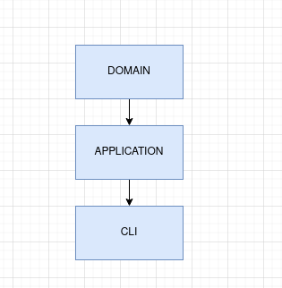

## Overview

## Requirements
- [Docker](https://www.docker.com/)
- [Node (20)](https://nodejs.org/en/)


**capital-gain-code-challenge** is a project designed to calculate capital gains for various financial assets. It provides a robust, testable, and containerized solution for processing transactions and computing taxes according to standard operation rules.

## Architecture

The project follows a [Clean architecture](https://blog.cleancoder.com/uncle-bob/2012/08/13/the-clean-architecture.html):



## Layers description

* DOMAIN - The core layer for business rules and domain entities.
* APPLICATION - Orchestrates operations and interacts with the domain to implement business requirements and use cases.
* CLI - Main layer with the application entry point.

## Docker

The project is fully containerized for easy deployment.

1. **Build docker image:**
   ```bash
   sudo docker build -t capital-gain-cli .
   ```

2. **Run:**
   ```bash
    sudo docker run --rm -i capital-gain-cli < input-stdin.example.txt
   ```

## Running Locally without Docker

1. **Install dependencies:**
   ```bash
   npm ci
   ```

2. **Build the application:**
   ```bash
   npm run build
   ```

3. **Run:**
   ```bash
    npx tsx ./src/cli/cli.ts < ./input-stdin.example.txt
   ```

## Running Tests

This project was initially developed using TDD (Test-Driven Development), based on the use cases provided in the technical assessment documentation.

After the application was fully developed, integration tests were implemented, and a pre-commit step was added to run regression tests automatically.


**Run all tests**

```bash
npm run test
# or run isolated unit test
npm run test:unit
# or run isolated integration test
npm run test:integration
```